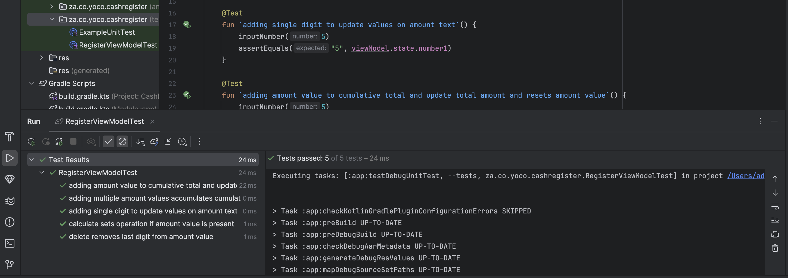

# Cash Register App

## Overview
The Cash Register App is an Android application built using Kotlin, Jetpack Compose, and various libraries to enhance functionality and maintain code quality.

## Libraries Used

### Jetpack Compose
- **Description**: A modern toolkit for building native UI in Android.
- **Website**: [Jetpack Compose](https://developer.android.com/jetpack/compose)

### Detekt
- **Description**: A static code analysis tool for Kotlin that helps in detecting code smells and improving code quality.
- **Website**: [Detekt](https://detekt.github.io/detekt/)

### LeakCanary
- **Description**: A memory leak detection library for Android. It helps to identify memory leaks in your application.
- **Website**: [LeakCanary](https://square.github.io/leakcanary/)

### Add Amount Screen Recording
- **Video**: [Add Amount](app/src/main/res/raw/add_values.mov)

### Delete Amount Screen Recording
- **Video**: [Delete Amount](app/src/main/res/raw/delete_values.mov)

### Test

### Leak Canary Report

### Detekt

## Usage
To run the Cash Register App, follow these steps:
1. Clone the repository to your local machine.
2. Open the project in Android Studio.
3. Build and run the application on an Android device or emulator.

